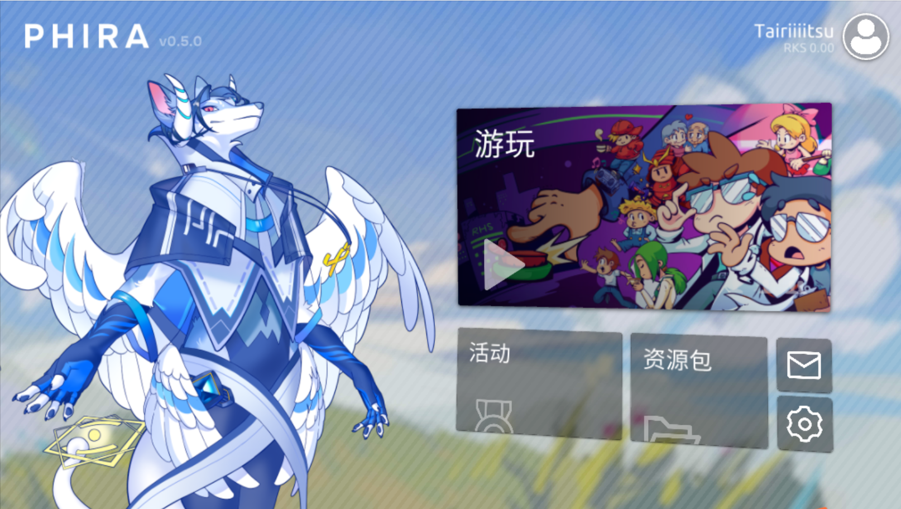
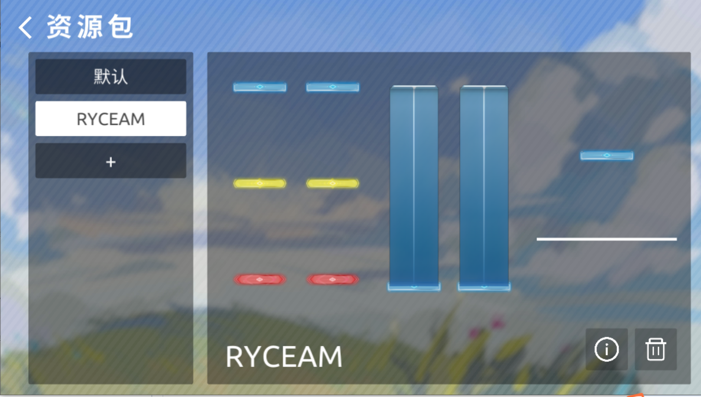
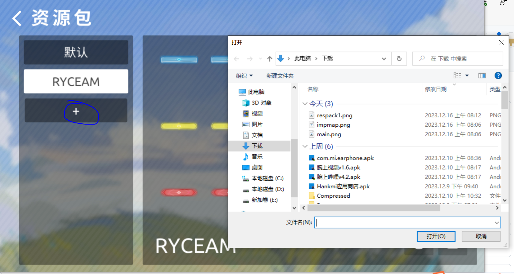
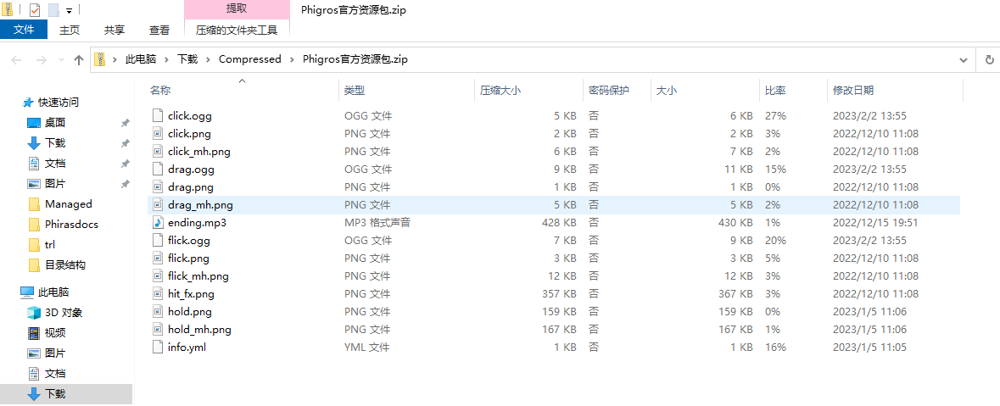

## 引入
总所周知,Phira有很多**皮肤**，使用这些皮肤可以**提升手感**，当然也有一些**生草/整活的皮肤**供你使用

## How to use it（如何导入）

1.打开**Phira**

2.点击主界面右下角的**资源包**

3.点击导入，选择你**下载**的资源包

*注：如果你的资源包是从**群内**下载的，可以选择**用其他应用打开**，"导入到Phira（资源包）"（当然你谱面也可以这么做，~~不过
我前面的都白写了，得选导入到Phira~~）

## Q/A
1.资源包无效？
依旧是**目录结构**不正确，或者是缺少文件，**正确的目录结构如下图**（懒得解压了.jpg）

2.iOS设备咋办
依旧**无法导入**，~~别想了~~

